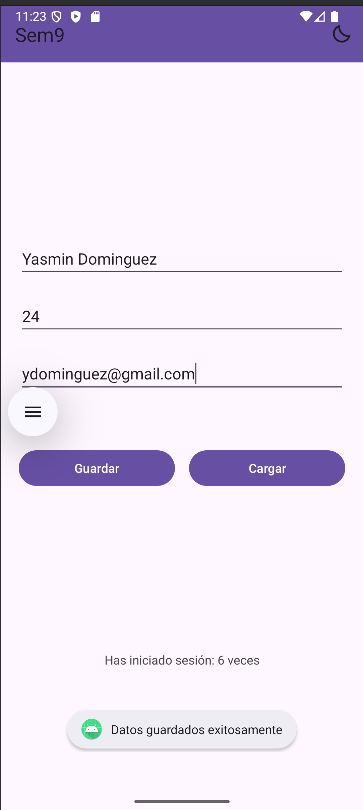
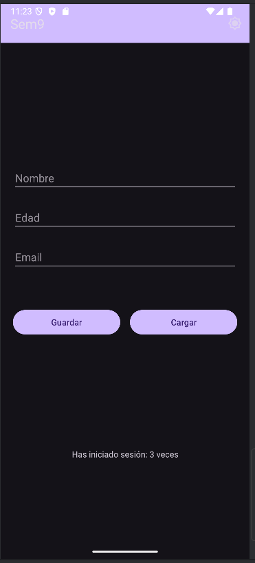

# 📱 Aplicación Android - Semana 9

Una aplicación Android desarrollada en Kotlin que permite gestionar datos de usuario con persistencia local y modo oscuro/claro.

## ✨ Características

- 📝 **Formulario de usuario** con validaciones
- 💾 **Persistencia de datos** usando SharedPreferences
- 🌙 **Modo oscuro/claro** con toggle dinámico
- 📊 **Contador de sesiones** iniciadas
- ✅ **Validaciones robustas** de entrada
- 🎨 **Interfaz moderna** con Material Design

## 🏗️ Arquitectura

```
app/
├── src/main/
│   ├── java/com/example/semana_9/
│   │   └── MainActivity.kt
│   ├── res/
│   │   ├── layout/
│   │   │   └── activity_main.xml
│   │   ├── menu/
│   │   │   └── toolbar_menu.xml
│   │   └── drawable/
│   │       ├── moon.xml
│   │       └── sun.xml
│   └── AndroidManifest.xml
```

## 📱 Screenshots

### Modo Claro


### Modo Oscuro

